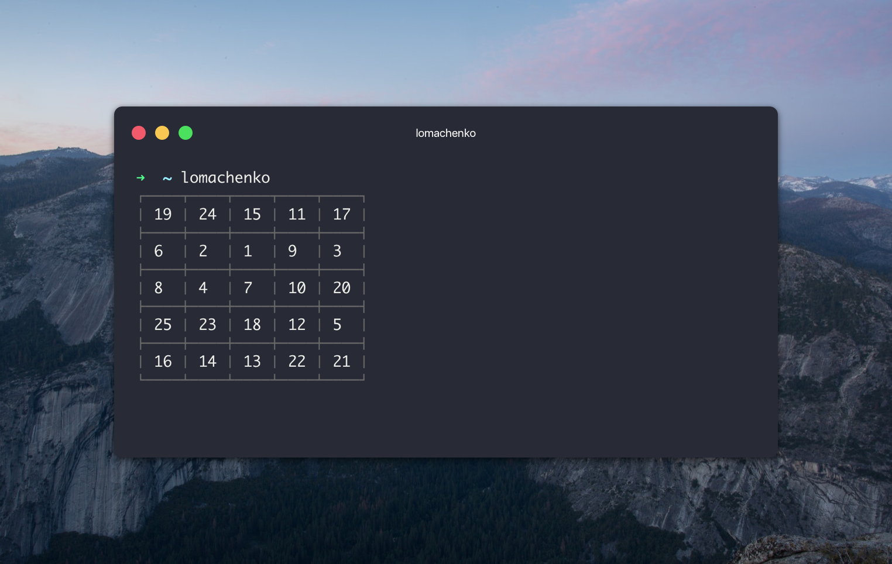

# lomachenko

> The glitch in The Matrix


## What is Lomachenko?

Actually, who is `Lomachenko`. He is a Ukrainian professional boxer. He has held the WBO super featherweight title since 2016, and previously the WBO featherweight title from 2014 to 2016; he won the latter title in his third professional fight. Lomachenko is currently one of the most highly-rated boxers in the sport. —[Wikipedia](https://en.wikipedia.org/wiki/Vasyl_Lomachenko)


## What this module has anything to do with box or code?

Lomachenko is known for his excellent hand speed, timing, accuracy, creativity, and foot movement, people call him `The Matrix`. Like `Neo` dodging the bullets.

He's training his brain to process and precisely react with his hands as fast as possible. That's the purpose of this module, to train the brain to process as fast as possible by looking for numbers.

## How it works?

When you run `lomachenko` on your terminal a `shuffled` table 5x5 will be shown to you. Try to look for numbers sequentially as fast as possible.


## Install

```bash
$ npm install -g lomachenko
```


## Usage

```bash
$ lomachenko --help

Usage:
  $ lomachenko

Options:
  -h, --help                    show help options
  -v, --version                 show version
```

## Demo



## License

MIT © Bu Kinoshita
